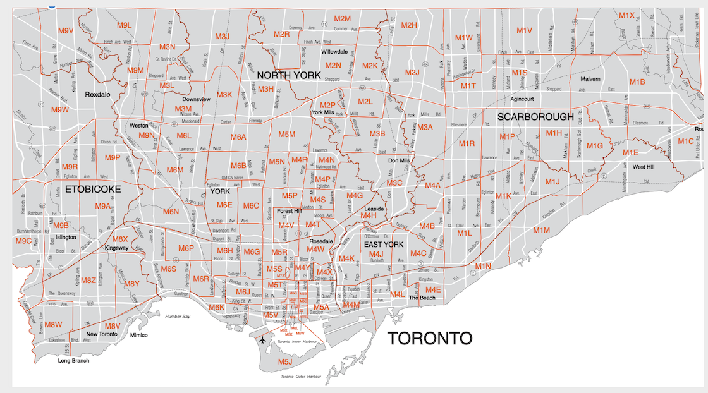

```{r setup, include=FALSE}
knitr::opts_chunk$set(echo = TRUE)
library(tidyverse)
library(dplyr)
library(kableExtra)
data1 <- read_csv("/Users/shiyingxuan/Downloads/304/COVID19 cases.csv")
```

# Introduction 

What is COVID-19? It is coronavirus, SARS-CoV-2, identified in 2019, has caused a pandemic of respiratory disease, called COVID-19. Coroncirus is spread by droplets and virus particles released into the air, and therefore, close contact is a key transmission of COVID-19 (Johns Hopkins Medicine 2021). Worldwide pandemic of COVID-19 have been in Canada because of an individual who had returned to Toronto from Wuhan, Hubei, China, tested positive and most cases of the pandemic have been in Ontario, British Columbia and Alberta. In Ontario, Toronto is affected by COVID-19 most seriously and it has the longest continous COVID-19 lockdown because Toronto is the most populous city in Canada (Wikipedia 2022). 

COVID-19 cases statistics play an important role for decreasing the negative influence of COVID-19. Data from COVID-19 cases in Toronto are often used to notice the safe places, the reasons for infection and who needs to care more. National Statistician Professor, Sir Ian Diamond said that statistics help give important insights, provide public understanding, develop prevention and aid with planning and provision of services (SAGE Publishing 2020). Therefore, I will analyze the dataset of COVID-19 cases in the Toronto and give several suggestions about prevention, understanding and action.
 
For this report, I will use open-access data from the City of Toronto's Open Data Portal to understand COVID-19 cases in Toronto, and then, I will analyze the number of COVID-19 cases related to age group, gender. Moreover, I discuss that different types of transmission of COVID-19 affect different age groups. Finally, with reference to Toronto's FSA map, I find the relation between the number of COVID-19 cases and geographical divisions. 


# Data 
## 3.1 Data source 

This report utilizes data about COVID-19 cases in Toronto that were obtained from the Toronto Public Health (TPH). Since 1883, the TPH has focused on protecting and promoting the health of Toronto residents. It reports the health and well-being of residents to the Board of Health (Toronto Public Health, 2022). COVID-19 cases in Toronto are published by Toronto Public Health on the City of Toronto's Open Data Portal (Gelfand 2020). Thus, the dataset of COVID-19 cases was downloaded in csv format from the City of Toronto's Open Data Portal. The dataset was refreshed on February 2nd, 2022.

## 3.2 Methodology and Data Collection

R statistical programming language is used for this analysis (R Core Team 2020), and more specifically, the tidyverse package (Wickham et al. 2019), dplyr(Wickham et al. 2021). The raw dataset has 272017 observations that contains information on COVID-19 cases in Toronto. This data is extracted from the provincial Case & Contact Management System (CCM). CCM is a central data repository that contains COVID-19 cases and contact management in Ontario (HealthSTATS, 2020). Although this dataset contains demographic, geographic, and severity information of all confirmed and probable case and includes cases, that are outbreak-associated, since the first case was reported in January 2020, this dataset still is not accurate and exists biases. 

The actual number of cases of COVID-19 is definitely more than the numbers in CCM. The biggest reason causing the bias is that not all people who have COVID-19 symptoms seek medical treatment or testing, and then, these cases cannot be recorded in CCM. The case number of homeless people is alarming because these people are not looking for medical treatment or testing. Thus, counting the COVID-19 cases of homeless people is difficult work (Muriel 2021). Currently, most people who get COVID-19  just experience mild illness and can recover at home, and therefore, they do not need to seek testing or medical treatment (MAYO clinic 2022). The cases of homeless people and people who get mild illness cannot be collected so the actual case number is much more than the case number of the dataset. 

## 3.3 Data Characteristic

The dataset obtains all confirmed and probable cases which contain demographic, geographic, and severity information, since the first case was reported in January 2020 (Toronto's Open Data Portal, 2022). There were 272017 observations in the dataset and 18 variables. I filtered 4 variables, Age group, Client Gender, FSA, Source of Infection and Episode Date, they describe almost important information, and then I mutated a new attribute for integer number of age group (Wickham et al. 2019). Age is age group at time of illness; Client Gender is self-reported biological sex; FSA is first three characters of postal code; Source of Infection is that distinct reasons cause the infection. Age group and gender are personal information. Source of Infection and geographic division are details of COVID-19 cases. These variables all are worth analyzing. A sample view of dataset is displayed blow. 
```{r, messsage =FALSE, warning=FALSE, echo = FALSE}
data2 <- data1 %>% select("Age Group", "Client Gender", "FSA", "Source of Infection") 
head(data2)
```
\newpage
### 3.3.1 Age group and Gender

According to information provided by the Toronto Public Health, Age Group and Client Gender are the basic information of patients. Age Group includes 19 and younger, 20-29, 30-39, 40-49, 50-59, 60-69, 70-79, 80-89, 90 and older. Figure 1 displays that the total number of COVID-19 cases distribute in different age group in Toronto. Client Gender just collects two options, male and female. Figure 2 displays that the total number of COVID-19 male and female cases in Toronto.

```{r, messsage =FALSE, warning=FALSE, echo = FALSE}
data3 <- data2 %>% mutate(new_age = 
                   case_when(
                     `Age Group` == "19 and younger" ~ 15,
                     `Age Group` == "20 to 29 Years" ~ 25,
                     `Age Group` == "30 to 39 Years" ~ 35,
                     `Age Group` == "40 to 49 Years" ~ 45,
                     `Age Group` == "50 to 59 Years" ~ 55,
                     `Age Group` == "60 to 69 Years" ~ 65,
                     `Age Group` == "70 to 79 Years" ~ 75,
                     `Age Group` == "80 to 89 Years" ~ 85,
                     `Age Group` == "90 and older" ~ 95,
                      ))

```

```{r hist, fig.cap = "The number of Toronro COVID-19 cases in different age groups",  fig.width = 6, fig.height = 4, messsage =FALSE, warning=FALSE, echo = FALSE}
data3 %>% ggplot(aes(x = `new_age`))+ geom_histogram(fill = "pink", color="black", bins = 10) + theme_classic() +
  labs(x = "Age Group", y="The Number of COVID-19 Cases in Toronto", title = "The Number of COVID-19 Cases in Different Age Groups") 
```

Based on figure 1, we can see a gradual decrease in the number of COVID-19 cases in Toronto from age 19 and younger to age 90 and older. It is right skewness and its center is at 20 to 29 years. It means that the most number of COVID-19 cases in Toronto happen in the age group 20 to 29 years. Obviously, the age group 90 and older has the least number of cases. From a COVID-19 report in Ontario, experts count the cumulative COVID-19 cases of February 3, 2022. It shows that the age group from 20 to 39 has the most cases (402,702) and the age group 80 and over has the least number of cases (44,339). Age from 40 to 59 and Age from 60 to 79 have 291,139 cases and 126,326 cases respectively（Public Health Ontario 2022). From the report, it matches the data that I analyze significantly. Infectious disease specialist Dr. Abdu Sharkawy explains that the second and third waves of the COVID-19 pandemic infect more people who are under the age of 40 (Brooklyn 2021). More young people who are ages between 20 to 39 were inflicted than other age groups.  

\newpage
```{r bar, fig.cap = "The number of Toronro COVID-19 cases in male and female",  fig.width = 6, fig.height = 4, messsage =FALSE, warning=FALSE, echo = FALSE}

data4 <- data3 %>% filter(`Client Gender`=="MALE"|`Client Gender`=="FEMALE") 
data4 %>% ggplot(aes(x=`Client Gender`, fill=`Client Gender`)) + geom_bar() + labs(x = "Client Gender", y = "The Number of COVID-19 Cases in Toronto", title = "The Number of COVID-19 Male and Female Cases in Toronto")

```

Based on figure 2, we can see a two-bar chart that shows an obvious comparison between female and male. The number of female COVID-19 cases in Toronto is slightly more than the number of male cases. From a COVID-19 report in Ontario, experts count the cumulative COVID-19 female and male cases of February 3, 2022. Female is 540,869 cases and male is 501,587 (Public Health Ontario 2022). The number of female COVID-19 cases is approximately 40000 more than male‘s. According to the latest data from the Public Health Agency of Canada, 55 percent of COVID-19 cases are women and 45 percent of COVID-19 cases in Canada (Olivia 2020). More women than men have been diagnosed with COVID-19. 

\newpage

### 3.3.2 Source of Infection 

Reported COVID-19 cases are broken up into five main kinds of infection. Household contact: case who acquired infection from a confirmed or probable COVID-19 case, such as roommate or family member. Close contact: case who acquired infection from a confirmed or probable COVID-19 case, such as co-worker or client. Travel: case that travelled outside of Ontario. Outbreaks: case is related to confirmed COVID-19 outbreaks in some places. Community: other sources of inflection except household contact, travel, close contact and outbreaks. Therefore, Close contact is the most frequent way to transmit virus and most transmission occurs indoors (Government of Canada 2021). Figure 3 displays that five main reasons of COVID-19 infection are distributed in different age groups. 

```{r boxplot, fig.cap = "The distribution of five main rources of infection",  fig.width = 8, fig.height = 6, messsage =FALSE, warning=FALSE, echo = FALSE}

data5 <- data3 %>% filter(`Source of Infection` == "Household Contact"|
                          `Source of Infection` == "Travel"|
                          `Source of Infection` == "Community"|
                          `Source of Infection` == "Close Contact"|
                          `Source of Infection` == "Outbreaks, Other Settings"
                          
                            ) 
data5 %>% ggplot(aes(x=`Source of Infection`, y=`new_age`)) + geom_boxplot()+ theme_classic() +
  labs(x = "Five Sources of Infection", y = "Age", title = "The Age Distribution of Five Main Sources of Infection ")
```

Base on figure 3, we can see the five main sources of infection on a box plot. The median values of Travel, Outbreaks, Community and Close Contact are almost equaled at 30 years old. Infectious disease specialist Dr. Abdu Sharkawy explains that the second and third waves of the COVID-19 pandemic infect more people who are under the age of 40 (Brooklyn 2021). The box plot proves that the number of young people in this dataset is more than the number of other age groups significantly. However, the median value of Household Contact is smaller than others. In COVID-19 Pandemic, schools were closed and government recommended youth, younge adults and students stay at home (Government of Canada 2022). Therefore, it increases the rate of infection that is caused by household contact greatly and more younger people get COVID-19 because of household contact. 

### 3.3.3 FSA 

A forward sortation area (FSA) is the first three characters in a Canadian postal code to identify a geographical unit. The first letter M means Metropolitan Toronto (Government of Canada 2015). Therefoe, FSA of the dataset describes the number of COVID-19 cases in every geographical unit of Toronto. Figure 4 shows every area pictured geographically in Toronto. Table 1 shows the number of cases in each FSA.

```{r picture, echo=FALSE, out.width="90%", fig.cap="The FSA in Toronto map."}

```

```{r , messsage =FALSE, warning=FALSE, echo = FALSE}
sort(table(data3$FSA))

```

From the table, M9V has the most number of COVID-19 cases (9114) and M1B ranks the second (8117). From the figure 4, we can see M9V is Rexdale that is the northwest of Toronto and M1B is Malvern that is close to Scarborough. Humber Heights-Westmount has the highest with 219 cases per 100,000 from November 2021 to December 2021 (Brooke 2021). Humber Heights-Westmount is in the M9V area so this area still had the most number of COVID-19 cases until December 2021. From DH news, low-income neighbourhoods and areas with higher proportion of essential workers have the most number of COVID-19 cases (Brooke 2021). The lowest incomes is found in Scarborough and Linkwood Lane Park which is the west of Toronto was in second (Better Dwelling 2017). It is an interesting finding because it is the reason why M9W and M1B have the most number of COVID-19 cases. 
\newpage


# Reference


